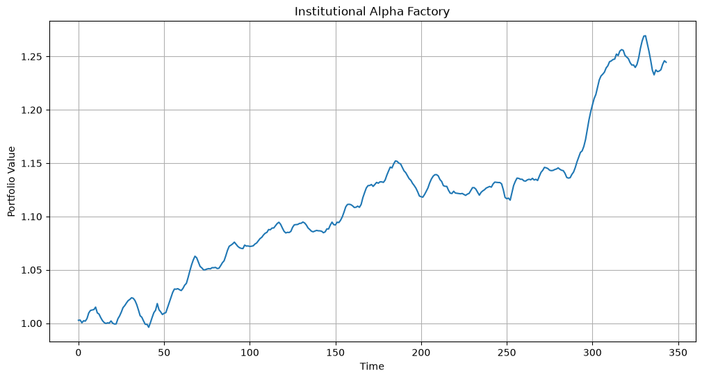

# Institutional Alpha Factory

Machine-learning based equity factor model for systematic stock selection.

## Overview

This project builds a quantitative investment strategy using:

- Momentum factors
- Volatility factors
- Relative strength indicators
- Random Forest prediction models

The model generates stock signals, constructs a portfolio and evaluates performance through historical backtesting.

## Results

- Total Return: 27%
- Sharpe Ratio: 4.32
- Max Drawdown: -0.07%

## Key Features

- Factor Engineering
- Machine Learning Alpha Generation
- Portfolio Construction
- Performance Analytics
- Feature Importance Analysis

## Technologies

- Python
- Pandas
- NumPy
- Scikit-Learn
- Matplotlib
- yFinance
